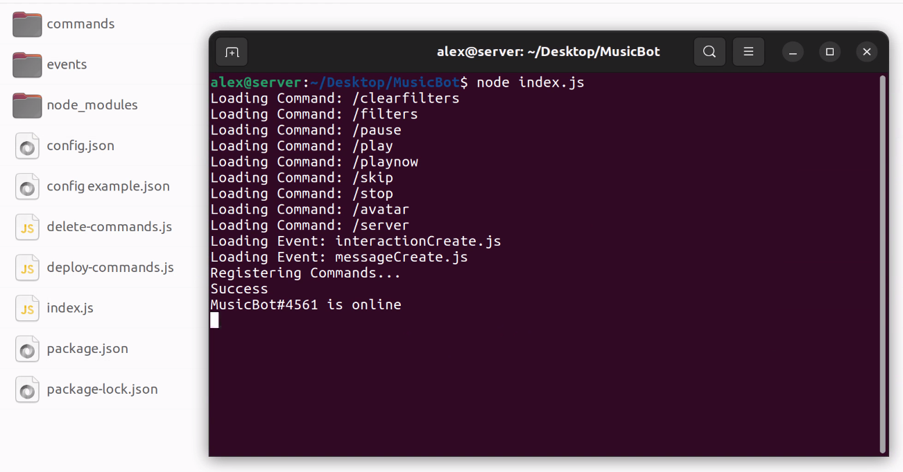

# Discord-Music-Bot
A Discord music bot with filters. Made with discord.js v14 and discord-player.

## Usage:
Edit config.json with your bots **token** and **client ID**, your **server ID**, **YouTube cookie**, and whatever **channel name** you want to send your commands in.

Start the bot with **node index.js**

Play a song with **/play** *or* **/playnow**

Skip songs with **/skip**

There are lots of filters available with **/filters**

